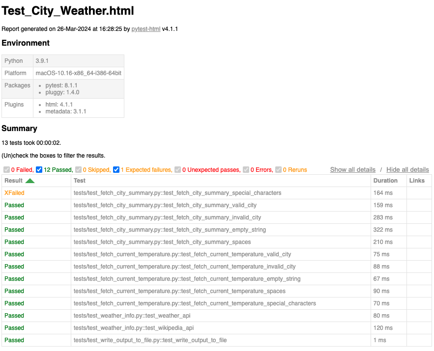

# City Weather Information

This project provides information about a city including a summary and the current temperature. The information is fetched from the OpenWeatherMap API and the Wikipedia API.

## Getting Started

These instructions will get you a copy of the project up and running on your local machine for development and testing purposes.

### Prerequisites

You need Python 3 installed on your machine. You also need the following Python packages:

- `pytest`
- `requests`
- `pip (Python package installer)`
- `pytest-html`

You can install them using pip:

```bash
pip install requests
```

```bash
pip install pytest
```

```bash
pip install pytest-html
```

or 

Install the required dependencies using pip:

```bash
pip install -r requirements.txt
```

## Running the Script

Before running the `weather_info.py` script, ensure you have set up the weather API key. Follow these steps:

1. Open the `config.py` file located in the main directory.
2. Find the variable `WEATHER_API_KEY` in `config.py`.
3. Paste the weather API key you received via email into the `WEATHER_API_KEY` variable. Make sure to replace the empty string with the API key.
4. Save and close the `config.py` file.

Once you've updated the API key, navigate to the project directory and run the following command:

```bash
python3 weather_info.py
```

When prompted, enter a city name. If the city name is valid, a new text file named after the city will be created in the project directory (e.g. Berlin.txt). This file will contain the city summary and current temperature.

## Running the Tests

This project uses the pytest framework for testing. To run the tests, navigate to the project directory and run the following command:

```bash
pytest -vs tests/
```

After the tests are executed, an HTML report will be generated in the results/directory using the pytest-html library.


